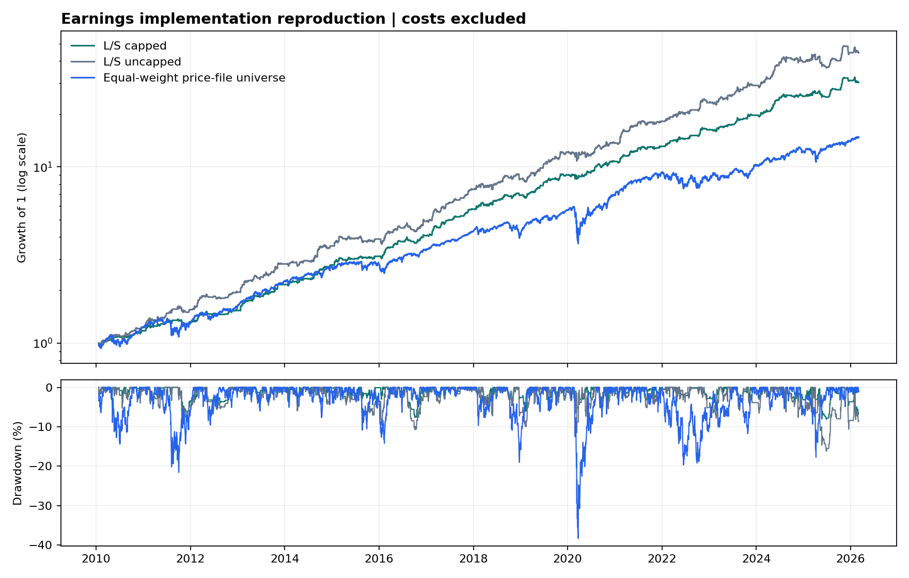

# Bundled earnings-surprise reproduction

Sample: **2010-01-21 to 2026-03-04**, with **4,054 observed periods** and 252 periods per year.

The figures below are computed by the reproduction script and checked against the saved return series. All Sharpe ratios use a 0% cash rate; trading and financing costs are excluded.

| Series | Total return | CAGR | Annualized volatility | Sharpe | Max drawdown |
| --- | ---: | ---: | ---: | ---: | ---: |
| L/S capped | 2912.90% | 23.58% | 9.47% | 2.28 | -8.10% |
| L/S uncapped | 4346.67% | 26.60% | 13.61% | 1.80 | -16.21% |
| Equal-weight price-file universe | 1372.18% | 18.20% | 18.09% | 1.02 | -38.30% |



## Interpretation

This reproduces the default script configuration on the two bundled input files. The benchmark is the daily mean of available returns across the price-file universe, rather than a downloaded index. Uncapped results are a sizing comparison, not a holdout.

The input contains 38,626 earnings rows and 497 price tickers. Average gross exposure is 40.9%; 1,148 periods are flat.

**Data and methodology limitations:**

- 6 signal tickers have no mapped price column and are excluded: EXPD UN Equity, FISV UW Equity, GRMN UN Equity, IBKR UW Equity, SMCI UW Equity, UAL UW Equity.
- The input has 392,157 missing price cells. The existing implementation forward-fills quotes: 0 active ticker-period cells depend on that assumption.
- 821 active ticker-period cells have no return even after quote filling; the existing portfolio sum contributes zero for those cells.
- Historical constituent coverage, delisting returns, and adjusted-price provenance have not been independently established for the bundled data.
- Entry dates use business-day offsets and close-to-close returns. Announcement timestamps and exchange-calendar execution realism remain unverified.
- Transaction costs, cash interest, borrow fees, and financing are excluded. The full-sample settings have no demonstrated untouched out-of-sample evaluation.
- The checks establish computational reproduction and sizing consistency. They do not establish investable performance.

## Verification checks

- unique ordered price dates and unique ticker columns.
- finite positive observed prices.
- independent capped-weight reconstruction.
- portfolio return equals long plus short contributions.
- no short-only positions and gross exposure at most 100%.

## Reproduction

From the repository root:

```bash
python -m pip install -r requirements-results.txt
python scripts/reproduce_results.py
python scripts/reproduce_results.py --check
```

Saved artifacts: [returns](earnings_surprise.returns.csv), [configuration, input hashes, code hashes, environment, and metrics](earnings_surprise.manifest.json).

Metric definitions and compatibility changes are documented in [BACKTESTING.md](../BACKTESTING.md).
