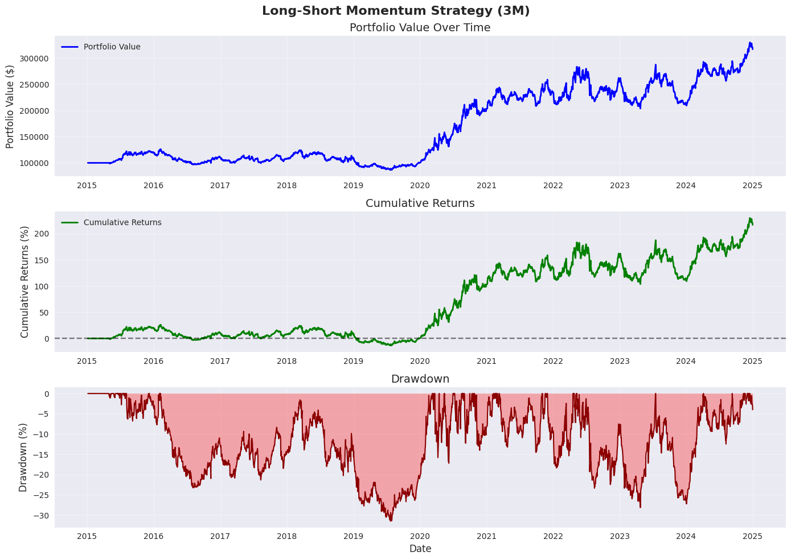

# Historical momentum experiment

The chart and metrics below were saved in the original momentum notebook at revision `49abbc19`. They have **not** been regenerated with the current backtester.

The experiment uses 30 US equities downloaded from Yahoo Finance, a 2015–2024 sample, three-month momentum, top/bottom-quintile selection, and monthly rebalancing. The original result contains 2,515 daily observations.

| Original saved metric | Value |
| --- | ---: |
| Total return | 216.82% |
| Annualized return | 12.25% |
| Annualized volatility | 23.01% |
| Maximum drawdown | -31.45% |

The earlier backtester compounded the full long-minus-short spread, equivalent to 100% long and 100% short exposure. The current 1x gross convention applies 50% to each book; its results will differ. The original Sharpe calculation also differed from the current shared definition. Costs were excluded, and the fixed selection of surviving equities needs a historical-universe review.

The original raw download was not saved as a fixed input, so a fresh Yahoo Finance run may use revised prices.

Continue with the [momentum notebook](../../src/playground/momentum_strategy/momentum_strategy.ipynb), or see [backtesting conventions](../BACKTESTING.md) for the calculation changes.
