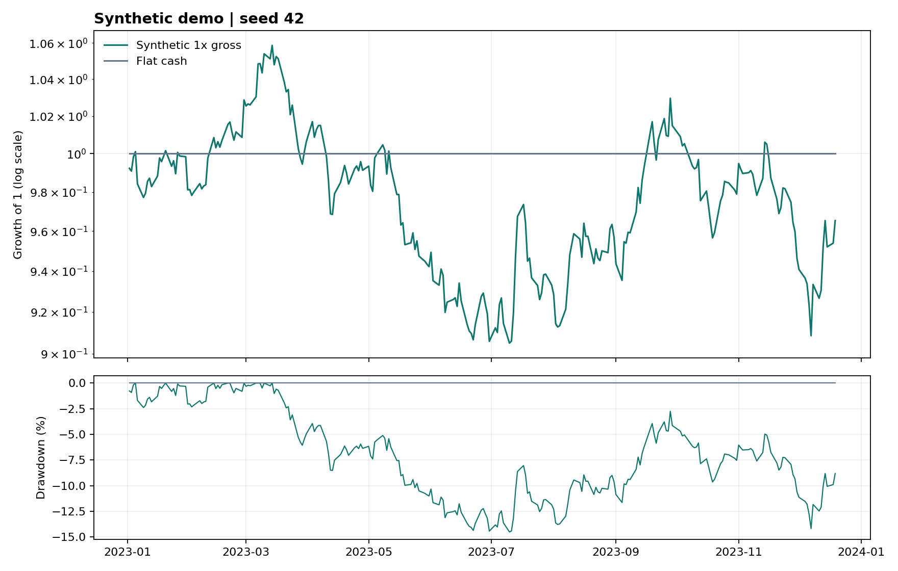

# Synthetic backtester demonstration

Sample: **2023-01-02 to 2023-12-19**, with **252 observed periods** and 252 periods per year.

The figures below are computed by the reproduction script and checked against the saved return series. All Sharpe ratios use a 0% cash rate; trading and financing costs are excluded.

| Series | Total return | CAGR | Annualized volatility | Sharpe | Max drawdown |
| --- | ---: | ---: | ---: | ---: | ---: |
| Synthetic 1x gross | -3.46% | -3.46% | 14.61% | -0.17 | -14.51% |
| Flat cash | 0.00% | 0.00% | 0.00% | undefined | 0.00% |



## Interpretation

Returns are generated with seed 42. Gross leverage 1 means 50% long and 50% short exposure, rebalanced each period. Flat cash earns 0% in this example. These numbers demonstrate the software and are not historical strategy performance.

## Reproduction

From the repository root:

```bash
python -m pip install -r requirements-results.txt
python scripts/reproduce_results.py
python scripts/reproduce_results.py --check
```

Saved artifacts: [returns](synthetic_demo.returns.csv), [configuration, input hashes, code hashes, environment, and metrics](synthetic_demo.manifest.json).

Metric definitions and compatibility changes are documented in [BACKTESTING.md](../BACKTESTING.md).
